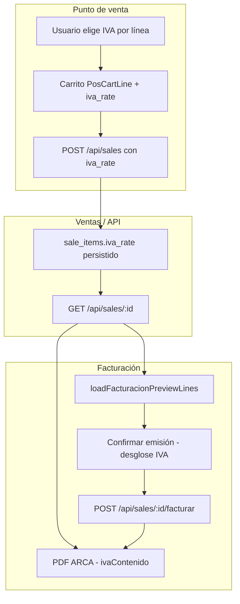

# IVA en ventas y facturación ARCA — Guía de alineación para frontend

Documento de referencia para que el equipo de frontend implemente, mantenga y pruebe el manejo de IVA (21%, 10,5% y 0% exento) en **Punto de venta**, **Ventas**, **Facturación ARCA** y PDFs asociados.

**Relacionado:** contrato backend en `docs/sale-items-iva-backend.md` · facturación general en `docs/facturacion.md` · ítems manuales POS en `docs/pos-items-manuales-backend.md`.

---

## 1. Objetivo de negocio

El usuario debe poder:

1. **Al vender (POS):** elegir la alícuota IVA de cada línea antes de cobrar.
2. **Al revisar ventas:** ver qué alícuota tenía cada ítem y el desglose fiscal informativo.
3. **Al facturar en ARCA:** confirmar que el comprobante refleja las alícuotas guardadas en la venta (el backend arma el payload AFIP; el frontend muestra preview y PDF).

**No confundir:**

| Concepto | Qué es | Dónde se elige |
|----------|--------|----------------|
| **Alícuota IVA por ítem** (`iva_rate`: 21 / 10,5 / 0) | Tasa sobre el importe de la línea | POS, por línea del carrito |
| **Condición IVA del receptor** (`condicionIvaReceptor`: 1, 5, 6…) | Perfil fiscal del cliente ante AFIP | Facturación, formulario de emisión |
| **Tipo de comprobante** (`tipo`: 1 Factura A, 6 Factura B, 11 Factura C…) | Letra del comprobante según emisor/receptor | Facturación (auto según cliente + emisor) |

La alícuota por ítem y la condición IVA del receptor son **independientes**. Ejemplo: un consumidor final (condición 5) puede comprar una línea al 10,5% y otra exenta.

---

## 2. Regla de precios (crítica)

En POS y ventas MF, los precios son **finales — IVA incluido**.

```
subtotal_linea = quantity × unit_price
total_venta    = Σ subtotal_linea
```

**No** se suma IVA encima del total al cobrar. El IVA se **descompone** del precio final solo para mostrar información fiscal y para que el backend genere el comprobante ARCA.

### Fórmulas (usar en todo el frontend)

```typescript
// IVA contenido en un importe final
iva = subtotal - subtotal / (1 + iva_rate / 100)

// Neto gravado (sin IVA)
neto = subtotal / (1 + iva_rate / 100)   // si iva_rate > 0
neto = subtotal                           // si iva_rate === 0
```

Redondeo: **2 decimales** (`Math.round(x * 100) / 100`).

### Ejemplos numéricos

| Cant. | P. unit. | `iva_rate` | Subtotal | IVA contenido | Neto |
|-------|----------|------------|----------|---------------|------|
| 1 | 121 | 21 | 121 | 21,00 | 100,00 |
| 1 | 110,50 | 10,5 | 110,50 | 10,50 | 100,00 |
| 1 | 100 | 0 | 100 | 0 | 100 |

Venta mixta (3 líneas): total = **331,50** · IVA total contenido = **31,50** (21 + 10,5 + 0).

---

## 3. Valores permitidos de `iva_rate`

| Valor API / estado | Etiqueta UI | Código WSFE alícuota (referencia backend) |
|--------------------|-------------|-------------------------------------------|
| `21` | `21%` | `5` |
| `10.5` | `10,5%` | `4` |
| `0` | `Exento (0%)` | `3` |

- **Default:** `21` si el campo falta, es `null` o es inválido.
- **Tipo TypeScript:** `SaleIvaRate = 21 | 10.5 | 0`
- **Constantes:** `SALE_IVA_RATES`, `DEFAULT_SALE_IVA_RATE` en `lib/sale-iva.ts`

### Normalización obligatoria

Siempre normalizar datos de API antes de mostrar o calcular:

```typescript
import { normalizeSaleIvaRate } from "@/lib/sale-iva"

const rate = normalizeSaleIvaRate(item.iva_rate) // siempre 21 | 10.5 | 0
```

Acepta: `21`, `"21"`, `10.5`, `"10.5"`, `0`, `"0"`, `undefined`, `null` → cualquier otro valor cae en `21`.

---

## 4. Contrato API (frontend ↔ backend)

### 4.1 Crear venta — `POST /api/sales`

Cada ítem envía `iva_rate` además de cantidad y precio.

**Línea de catálogo:**

```json
{
  "product_id": 10,
  "quantity": 2,
  "unit_price": 60500,
  "iva_rate": 21
}
```

**Línea manual (sin `product_id`):**

```json
{
  "description": "Instalación de software",
  "quantity": 1,
  "unit_price": 55000,
  "iva_rate": 10.5
}
```

**Body completo de ejemplo:**

```json
{
  "items": [
    { "product_id": 10, "quantity": 1, "unit_price": 121000, "iva_rate": 21 },
    { "description": "Servicio puntual", "quantity": 1, "unit_price": 110500, "iva_rate": 10.5 },
    { "description": "Ítem exento", "quantity": 1, "unit_price": 50000, "iva_rate": 0 }
  ],
  "payment_method": "efectivo",
  "client_id": 42,
  "notes": "opcional"
}
```

**Validación frontend (antes de enviar):**

- `iva_rate` debe ser `21`, `10.5` o `0` (el mapper POS siempre envía uno de los tres).
- `unit_price` ≥ 0.
- Ítems manuales: `description` no vacío.
- Pago mixto: efectivo + tarjeta + transferencia = total del carrito.

**Respuesta esperada (`data.items[]`):**

```json
{
  "product_id": 10,
  "product_name": "Notebook XYZ",
  "quantity": 1,
  "unit_price": 121000,
  "subtotal": 121000,
  "iva_rate": 21
}
```

Si el backend aún no persiste `iva_rate`, el frontend **sigue enviándolo** y asume `21` al leer respuestas sin el campo.

---

### 4.2 Listar / detalle venta — `GET /api/sales`, `GET /api/sales/:id`

Cada ítem debe incluir `iva_rate`. Ventas históricas sin el campo → tratar como `21` con `normalizeSaleIvaRate`.

Campos de ítem relevantes para IVA:

| Campo | Uso frontend |
|-------|----------------|
| `quantity` | Cantidad |
| `unit_price` | Precio unitario final (IVA incluido) |
| `subtotal` o `total_price` | Importe de línea |
| `iva_rate` | Alícuota para etiqueta y desglose |

---

### 4.3 Facturar — `POST /api/sales/:id/facturar`

El body **no** incluye `iva_rate` por ítem hoy. El backend debe leerlo de `sale_items` persistidos.

```json
{
  "tipo": 6,
  "condicionIvaReceptor": 5,
  "concepto": 1,
  "docTipo": 99,
  "docNro": 0,
  "force": false
}
```

Flujo frontend:

1. Usuario cobra en POS con `iva_rate` por línea → venta guardada.
2. En Facturación, `loadFacturacionPreviewLines` carga ítems con `ivaRate`.
3. Diálogo de confirmación muestra columna IVA y desglose.
4. `facturarSale(saleId, payload)` — backend usa alícuotas de la venta.

**Dependencia:** sin backend alineado, ARCA podría seguir facturando todo al 21%. El preview del frontend ya mostrará las alícuotas correctas.

---

## 5. Tipos TypeScript en el repo

### `lib/api.ts`

```typescript
export interface CreateSaleCatalogItem {
  product_id: number
  quantity: number
  unit_price: number
  iva_rate?: number
}

export interface CreateSaleCustomItem {
  description: string
  quantity: number
  unit_price: number
  iva_rate?: number
}

export interface SaleItemResponse {
  product_id?: number | null
  product_name?: string | null
  description?: string | null
  quantity: number
  unit_price: number
  iva_rate?: number | null
  subtotal?: number
  total_price?: number
}
```

### `lib/pos-cart.ts`

```typescript
export type PosCatalogCartLine = {
  kind: "catalog"
  product: Product
  quantity: number
  unit_price: number
  iva_rate: SaleIvaRate
}

export type PosCustomCartLine = {
  kind: "custom"
  lineId: string
  description: string
  quantity: number
  unit_price: number
  iva_rate: SaleIvaRate
}
```

### `lib/facturacion-preview-lines.ts`

```typescript
export interface FacturacionPreviewLine {
  description: string
  quantity: number
  unitPrice: number
  subtotal: number
  ivaRate: SaleIvaRate
}
```

---

## 6. Módulo central — `lib/sale-iva.ts`

**Fuente única de verdad** para alícuotas y cálculos. No duplicar fórmulas en componentes.

| Export | Uso |
|--------|-----|
| `SALE_IVA_RATES` | Opciones del selector `[21, 10.5, 0]` |
| `DEFAULT_SALE_IVA_RATE` | Valor al agregar producto al carrito (`21`) |
| `normalizeSaleIvaRate(value)` | Leer API / query / formularios |
| `formatSaleIvaRateLabel(rate)` | Texto UI: `"21%"`, `"10,5%"`, `"Exento (0%)"` |
| `ivaFromInclusiveAmount(amount, rate)` | IVA contenido de una línea |
| `netFromInclusiveAmount(amount, rate)` | Neto gravado |
| `computeSaleIvaBreakdown(items)` | Desglose agregado de toda la venta |
| `afipAlicuotaIdFromRate(rate)` | Solo referencia; el backend mapea a WSFE |

### `computeSaleIvaBreakdown` — resultado

```typescript
interface SaleIvaBreakdown {
  subtotalInclIva: number  // suma de subtotales
  iva21: number            // IVA contenido al 21%
  iva105: number           // IVA contenido al 10,5%
  ivaExento: number        // importe de líneas al 0% (no es "IVA", es base exenta)
  ivaTotal: number         // iva21 + iva105
}
```

Uso típico:

```typescript
const breakdown = computeSaleIvaBreakdown(
  cart.map((line) => ({
    subtotal: line.quantity * line.unit_price,
    iva_rate: line.iva_rate,
  }))
)
```

---

## 7. Componentes UI

### `components/iva-rate-select.tsx`

Selector reutilizable de alícuota.

```tsx
<IvaRateSelect
  value={line.iva_rate}
  onChange={(rate) => onSetIvaRate(lineKey, rate)}
  size="sm"           // opcional: "sm" | "default"
  disabled={false}
  id="mi-campo-iva"
  className="..."
/>
```

Props:

| Prop | Tipo | Descripción |
|------|------|-------------|
| `value` | `number \| null` | Alícuota actual (se normaliza internamente) |
| `onChange` | `(rate: SaleIvaRate) => void` | Callback al cambiar |
| `disabled` | `boolean` | Deshabilita el select |
| `size` | `"sm" \| "default"` | Tamaño compacto para filas de carrito |

---

### Punto de venta — `app/punto-venta/page.tsx`

| Acción | Comportamiento |
|--------|----------------|
| Agregar producto de catálogo | `iva_rate: 21` por defecto |
| Agregar ítem manual | Usuario elige IVA en `PosManualItemCard` (default 21) |
| Editar en carrito | `IvaRateSelect` en cada fila (`PosCartItemRow`) |
| Total a cobrar | `Σ (qty × unit_price)` — **sin** sumar IVA extra |
| Resumen fiscal | Muestra IVA 21%, 10,5% y exento si aplica |
| Al cobrar | `posCartLinesToCreateSaleItems(cart)` incluye `iva_rate` |

Handlers clave:

- `setCartIvaRate(lineKey, iva_rate)`
- `addCustomToCart({ description, quantity, unit_price, iva_rate })`

---

### Ítem manual — `components/pos-manual-item-card.tsx`

Campos: descripción, cantidad, precio unitario, **IVA**.

Al confirmar:

```typescript
onAdd({ description, quantity, unit_price, iva_rate })
```

Resetea IVA a `21` después de agregar.

---

### Fila de carrito — `components/pos-cart-item-row.tsx`

Nueva prop obligatoria:

```typescript
onSetIvaRate: (lineKey: string, iva_rate: SaleIvaRate) => void
```

Muestra `IvaRateSelect` en vistas `list`, `grid` y `table`.

---

### Detalle de venta — `components/sale-detail-modal.tsx`

- Columna **IVA** en tabla de artículos.
- Pie con desglose (`computeSaleIvaBreakdown` sobre `sale.items`).
- `iva_rate` ausente → mostrar `21%` vía `normalizeSaleIvaRate`.

---

### Facturación — `components/facturacion-emit-confirm-dialog.tsx`

- Tabla de líneas con columna **IVA**.
- Bloque de totales: IVA 21%, 10,5%, exento, total comprobante.
- Líneas cargadas por `loadFacturacionPreviewLines`.

---

### PDF ARCA — `lib/build-arca-invoice-pdf-input.ts`

- `totales.ivaContenido` = `computeSaleIvaBreakdown(...).ivaTotal` (ya no asume 21% fijo).
- Aplica a Factura B/C (Ley 27.743) cuando corresponda.

---

## 8. Flujos de datos (diagrama)



---

## 9. Pantallas y estado de implementación

| Pantalla / módulo | IVA por línea | Desglose fiscal | Envía `iva_rate` a API |
|-------------------|---------------|-----------------|------------------------|
| Punto de venta | ✅ | ✅ | ✅ |
| Ventas → detalle | ✅ (lectura) | ✅ | — |
| Facturación → confirmar | ✅ (lectura) | ✅ | — (backend lee venta) |
| PDF ARCA (preview/descarga) | ✅ (cálculo) | ✅ | — |
| Comprobante interno POS (PDF ticket) | ❌ | ❌ | — |
| Pedidos (`new-order-modal`) | ✅ (solo UI pedidos) | ✅ | ⚠️ otro módulo / API |
| Reparaciones facturables | Default 21% | ✅ | ⚠️ sin `iva_rate` en API reparación |

---

## 10. Casos borde y compatibilidad

### Ventas antiguas sin `iva_rate`

```typescript
normalizeSaleIvaRate(undefined) // → 21
```

Mostrar `21%` y calcular IVA contenido como 21% sobre cada línea.

### Backend que ignora `iva_rate` al crear venta

- POS envía el campo igualmente.
- Al facturar, preview y PDF usarán 21% hasta que GET devuelva el valor real.
- Coordinar deploy backend antes de producción fiscal mixta.

### Misma línea de catálogo con distinta alícuota

Hoy **no** se permite: una línea por `product_id` en el carrito. Si el usuario necesita el mismo producto con dos alícuotas, debe usar ítem manual para una de las líneas o agregar dos veces cambiando IVA antes de duplicar (limitación actual).

### Producto con IVA por defecto en catálogo (futuro)

El modelo `Product` **aún no** tiene `iva_rate`. Cuando el backend lo agregue:

```typescript
// al addToCart:
iva_rate: normalizeSaleIvaRate(product.iva_rate)
```

### Reparaciones

`RepairOrderItem` no expone `iva_rate`. En preview de facturación las líneas de reparación se muestran con **21%** fijo hasta que el backend las soporte.

### Condición IVA receptor vs alícuota ítem

- **Factura C (monotributo emisor):** suele mostrarse "IVA contenido" global (Ley 27.743); el frontend suma IVA de todas las líneas gravadas.
- **Factura A:** el desglose por alícuota lo arma el backend en AFIP; el frontend solo informa en preview.

---

## 11. Qué NO hace el frontend (hoy)

1. **No** envía overrides de `iva_rate` en `POST /api/sales/:id/facturar`.
2. **No** recalcula `total_amount` de la venta al cambiar IVA (el total es precio × cantidad; cambiar IVA no cambia el precio cobrado).
3. **No** llama al facturador ARCA directamente.
4. **No** valida coherencia fiscal emisor/receptor/alícuota (responsabilidad backend/contador).

### Evolución posible (no implementada)

Permitir editar `iva_rate` en el modal de facturación **antes** de emitir, con `PATCH` de la venta o campo extra en `facturar`. Requiere contrato backend nuevo.

---

## 12. Checklist de implementación frontend

### Punto de venta

- [x] `PosCartLine` incluye `iva_rate`
- [x] Selector IVA en carrito (list / grid / table)
- [x] Selector IVA en ítem manual
- [x] Default 21% al agregar producto
- [x] `POST /api/sales` envía `iva_rate` en cada ítem
- [x] Desglose IVA antes del botón Cobrar

### Ventas

- [x] Detalle de venta muestra columna IVA
- [x] Desglose en pie del modal
- [x] Normalizar `iva_rate` ausente → 21

### Facturación

- [x] Preview lines con `ivaRate`
- [x] Diálogo confirmación con columna y totales IVA
- [x] PDF ARCA con `ivaContenido` calculado por línea

### Tests

- [x] `lib/sale-iva.test.ts` — normalización, fórmulas, venta mixta
- [ ] E2E manual: venta mixta → facturar → PDF

### Pendiente opcional

- [ ] Ticket PDF POS con columna IVA
- [ ] `iva_rate` default desde `Product` cuando exista en API
- [ ] Reparaciones con `iva_rate` por ítem
- [ ] Editar IVA al facturar (sin rehacer venta)

---

## 13. Pruebas manuales sugeridas

### Caso A — Venta mixta POS

1. Agregar producto $121.000 con IVA 21%.
2. Agregar ítem manual $110.500 con IVA 10,5%.
3. Agregar ítem manual $50.000 exento.
4. Verificar total **$281.500** y desglose: IVA 21% = $21.000, IVA 10,5% = $10.500, exento = $50.000.
5. Cobrar y verificar en red que cada ítem del POST lleva `iva_rate` correcto.

### Caso B — Detalle y facturación

1. Abrir venta en Ventas → Ver detalle: columnas y desglose correctos.
2. Ir a Facturación → Facturar → Confirmar: misma alícuota por línea.
3. Descargar PDF ARCA: `ivaContenido` ≈ $31.500 (21 + 10,5).

### Caso C — Compatibilidad

1. Simular respuesta GET sin `iva_rate` (o venta antigua).
2. UI debe mostrar 21% y no romper cálculos.

---

## 14. Referencia rápida de archivos

| Archivo | Rol |
|---------|-----|
| `lib/sale-iva.ts` | Constantes, normalización, fórmulas, desglose |
| `lib/sale-iva.test.ts` | Tests unitarios |
| `lib/api.ts` | Tipos `CreateSaleItem`, `SaleItemResponse` |
| `lib/pos-cart.ts` | Modelo carrito + mapper a API |
| `lib/sale-items.ts` | Helpers display name, mappers receipt |
| `lib/facturacion-preview-lines.ts` | Líneas para modal facturación |
| `lib/build-arca-invoice-pdf-input.ts` | Totales IVA para PDF ARCA |
| `components/iva-rate-select.tsx` | Selector UI |
| `components/pos-cart-item-row.tsx` | Fila carrito con IVA |
| `components/pos-manual-item-card.tsx` | Alta ítem manual con IVA |
| `components/sale-detail-modal.tsx` | Detalle venta |
| `components/facturacion-emit-confirm-dialog.tsx` | Confirmación ARCA |
| `app/punto-venta/page.tsx` | Orquestación POS |
| `docs/sale-items-iva-backend.md` | Contrato para equipo backend |

---

## 15. Coordinación con backend (resumen)

El frontend **ya está alineado** para enviar y mostrar `iva_rate`. Para que ARCA reciba alícuotas reales, el backend debe:

1. Persistir `sale_items.iva_rate`.
2. Devolverlo en GET de ventas.
3. Usarlo en `POST /api/sales/:id/facturar` (mapeo WSFE + importes).

Hasta entonces, la UI fiscal es correcta pero la emisión AFIP puede seguir en 21% global.

---

*Última actualización: junio 2026 — alineado con implementación en rama actual del ERP Next.js.*
