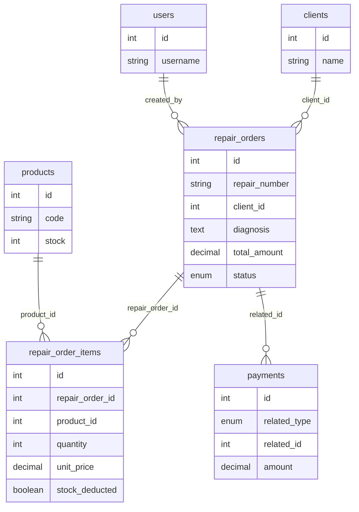

# Módulo de Órdenes de Reparación

## 1. Introducción y caso de uso

El dueño del negocio recibe equipos electrónicos (computadoras, etc.) para reparar. El cliente lleva el equipo y se registra una **orden de reparación**. El flujo de trabajo es el siguiente:

1. **Recibir el equipo:** se registra la entrada del equipo, el cliente y la fecha de recepción.
2. **Revisar y evaluar:** el técnico revisa el equipo, realiza el diagnóstico del problema y evalúa costos de **materiales** (productos del stock del sistema) y **mano de obra**.
3. **Enviar presupuesto:** se envía al cliente el presupuesto con el diagnóstico y el monto total (materiales + mano de obra).
4. **Decisión del cliente:**
   - **Si acepta:** se confirma la orden, se comienza el trabajo y en ese momento se **descuenta del stock** los materiales a utilizar. Se genera un documento para el cliente con detalle, fecha de recepción, fecha estimada de entrega (opcional), monto a pagar y el aviso legal sobre retiro del equipo.
   - **Si no acepta:** se cancela la reparación, se devuelve el equipo al cliente y, en caso de haber reservado o descontado materiales, se **reincorporan al stock**.

Además, al aceptar el presupuesto el cliente recibe un documento con: detalle del trabajo, fecha de recepción, fecha estimada de entrega (opcional), monto a pagar y un **comentario tipo**: *"Pasados los X días de finalizado el trabajo, si el cliente no pasa a retirar el equipo reparado no tiene derecho a reclamo"* (el valor X es configurable, ej. 30 días).

En este documento se especifica el modelo de datos, la API, las reglas de negocio y las directivas para el frontend. No se implementa código; solo se documenta el diseño.

---

## 2. Modelo de datos

### 2.1 Tabla `repair_orders`

| Campo | Tipo | Descripción |
|-------|------|-------------|
| `id` | int, PK, AUTO_INCREMENT | Identificador interno |
| `repair_number` | varchar(50), UNIQUE | Número único de orden, formato `REP-YYYYMM-0001` |
| `client_id` | int, FK → clients.id | Cliente que entrega el equipo |
| `equipment_description` | text | Descripción del equipo recibido (marca, modelo, etc.) |
| `diagnosis` | text | Diagnóstico del problema (para el presupuesto) |
| `work_description` | text | Descripción del trabajo a realizar (detalle para el cliente) |
| `reception_date` | date/datetime | Fecha de recepción del equipo (obligatoria) |
| `delivery_date_estimated` | date/datetime, NULL | Fecha estimada de entrega (opcional, se puede actualizar) |
| `delivery_date_actual` | date/datetime, NULL | Fecha real de entrega (al marcar como entregado) |
| `labor_amount` | decimal(12,2) | Monto de mano de obra |
| `total_amount` | decimal(12,2) | Total = suma de ítems + labor_amount (o manual) |
| `amount_paid` | decimal(12,2) DEFAULT 0 | Total pagado (denormalizado; se actualiza al registrar pagos) |
| `status` | enum | Ver estados en sección 2.3 |
| `budget_sent_at` | datetime, NULL | Fecha/hora en que se envió el presupuesto al cliente |
| `accepted_at` | datetime, NULL | Fecha/hora en que el cliente aceptó (o se confirmó la orden) |
| `days_to_claim` | int, NULL | Días para retiro antes de perder derecho a reclamo (ej. 30) |
| `notes` | text, NULL | Notas internas |
| `created_by` | int, FK → users.id, NULL | Usuario que creó la orden |
| `created_at` | timestamp | |
| `updated_at` | timestamp | |

**Saldo (calculado):** `balance = total_amount - amount_paid`.

### 2.2 Tabla `repair_order_items`

Productos del stock que se usan (o se cotizan) en la reparación.

| Campo | Tipo | Descripción |
|-------|------|-------------|
| `id` | int, PK, AUTO_INCREMENT | |
| `repair_order_id` | int, FK → repair_orders.id | Orden de reparación |
| `product_id` | int, FK → products.id | Producto del catálogo |
| `quantity` | int | Cantidad |
| `unit_price` | decimal(10,2) | Precio unitario al momento de agregar |
| `total_price` | decimal(10,2) | quantity * unit_price |
| `stock_deducted` | tinyint(1) DEFAULT 0 | 1 = ya se descontó del stock (solo cuando orden aceptada) |
| `created_at` | timestamp | |

El stock se descuenta **solo cuando el cliente acepta** el presupuesto y la orden pasa a estado en el que se considera iniciado el trabajo (ver reglas de negocio). Si la orden se cancela (cliente no acepta), no debe haberse descontado stock; si por algún motivo se había reservado, se devuelve.

### 2.3 Estados de la orden (`status`)

| Valor (API/BD) | Etiqueta | Descripción |
|----------------|----------|-------------|
| `consulta_recibida` | Consulta recibida | Equipo recibido, aún no se envía presupuesto |
| `presupuestado` | Presupuestado | Presupuesto (diagnóstico + materiales + mano de obra) enviado al cliente |
| `aceptado` | Aceptado | Cliente aceptó; aquí se descuenta el stock de los ítems |
| `en_proceso_reparacion` | En proceso de reparación | Trabajo en curso |
| `listo_entrega` | Listo entrega | Reparación terminada, pendiente de retiro por el cliente |
| `entregado` | Entregado | Equipo entregado al cliente (y opcionalmente cobrado) |
| `cancelado` | Cancelado | Cliente no aceptó o se canceló; se devuelve equipo y, si aplica, stock |

Transiciones típicas:

- `consulta_recibida` → `presupuestado` (al enviar presupuesto)
- `presupuestado` → `aceptado` (cliente acepta; **aquí se descuenta stock**)
- `presupuestado` → `cancelado` (cliente no acepta; **no se descuenta stock**, o se devuelve si se había reservado)
- `aceptado` → `en_proceso_reparacion` → `listo_entrega` → `entregado`
- Cualquier estado (salvo entregado/cancelado) → `cancelado` si aplica

### 2.4 Relación con `payments`

Los pagos del cliente por la reparación se registran en la tabla existente `payments`:

- `type = 'income'`
- `related_type = 'repair_order'` (requiere extender el enum en la migración)
- `related_id` = `repair_orders.id`

Al registrar un pago, se actualiza `repair_orders.amount_paid` (suma de pagos vinculados) para tener el saldo disponible sin recalcular cada vez.

### 2.5 Diagrama de entidades



---

## 3. API propuesta

Base URL: `/api/repair-orders` (con prefijo `/api` según configuración del servidor).

**Autenticación:** igual que en ventas POS: header `Authorization: Bearer <token>` (JWT) o `x-api-key: <api-key>`.

La API puede aceptar **snake_case** o **camelCase** en el body (normalización tipo `normalizeSaleBody` en ventas); las respuestas en JSON usan **snake_case**.

### 3.1 Órdenes de reparación

| Método | Ruta | Descripción |
|--------|------|-------------|
| GET | `/api/repair-orders` | Listado con filtros (estado, client_id, date_from, date_to, page, limit) |
| POST | `/api/repair-orders` | Crear orden (estado inicial `consulta_recibida`) |
| GET | `/api/repair-orders/:id` | Obtener una orden por ID (con ítems y datos de cliente) |
| PUT | `/api/repair-orders/:id` | Actualizar orden (datos editables según estado) |
| GET | `/api/repair-orders/stats` | Estadísticas (totales por estado, montos, etc.) |

**Crear orden (POST)** – Ejemplo de body:

```json
{
  "client_id": 1,
  "equipment_description": "Notebook Dell Inspiron 15, pantalla rota",
  "diagnosis": "Pantalla LCD dañada, reemplazo necesario",
  "work_description": "Reemplazo de pantalla y revisión general",
  "reception_date": "2026-03-10",
  "delivery_date_estimated": "2026-03-20",
  "labor_amount": 15000,
  "notes": ""
}
```

| Campo | Tipo | Requerido | Descripción |
|-------|------|-----------|-------------|
| client_id | int | Sí | ID del cliente |
| equipment_description | string | Sí | Descripción del equipo |
| diagnosis | string | No | Diagnóstico (presupuesto) |
| work_description | string | No | Trabajo a realizar |
| reception_date | string (date) | Sí | Fecha de recepción |
| delivery_date_estimated | string (date) | No | Fecha estimada de entrega |
| labor_amount | number | No | Mano de obra (default 0) |
| notes | string | No | Notas internas |

**Actualizar orden (PUT)** – Se pueden enviar los mismos campos editables; según estado no se permiten ciertos cambios (ej. ítems o total si ya está `entregado`).

**Respuesta exitosa (201/200):** estándar `ApiResponse`: `{ "success": true, "message": "...", "data": { ... }, "timestamp": "..." }`.

**Errores:** 400 (validación; `data` puede ser array de errores por campo), 401 (no autenticado), 404 (orden no encontrada).

### 3.2 Ítems de la orden (materiales)

| Método | Ruta | Descripción |
|--------|------|-------------|
| GET | `/api/repair-orders/:id/items` | Listar ítems |
| POST | `/api/repair-orders/:id/items` | Agregar ítem (product_id, quantity, unit_price). No descuenta stock hasta que la orden pase a `aceptado`. |
| PUT | `/api/repair-orders/:id/items/:itemId` | Editar cantidad/precio (con cuidado si ya se descontó stock) |
| DELETE | `/api/repair-orders/:id/items/:itemId` | Quitar ítem; si ya se había descontado stock, la API debe devolver stock |

**Agregar ítem (POST)** – Ejemplo:

```json
{
  "product_id": 5,
  "quantity": 1,
  "unit_price": 8500
}
```

El backend calcula `total_price` y persiste. El **total_amount** de la orden puede recalcularse como `labor_amount + SUM(items.total_price)` o permitirse override manual según reglas de negocio.

### 3.3 Presupuesto y transiciones de estado

| Método | Ruta | Descripción |
|--------|------|-------------|
| POST | `/api/repair-orders/:id/send-budget` | Pasar a `presupuestado` (registrar `budget_sent_at`) |
| POST | `/api/repair-orders/:id/accept` | Cliente acepta: pasar a `aceptado`, **descontar stock** de los ítems, registrar `accepted_at`. Opcional: body con `days_to_claim` (ej. 30) para el documento. |
| POST | `/api/repair-orders/:id/cancel` | Pasar a `cancelado`; si había stock descontado o reservado, **devolver** al stock. |
| PUT | `/api/repair-orders/:id/status` | Transiciones permitidas: `aceptado` → `en_proceso_reparacion` → `listo_entrega` → `entregado`. Body: `{ "status": "en_proceso_reparacion" }`, `{ "status": "listo_entrega" }` o `{ "status": "entregado" }`. |

### 3.4 Documento para el cliente (al aceptar)

| Método | Ruta | Descripción |
|--------|------|-------------|
| GET | `/api/repair-orders/:id/acceptance-document` | Devuelve datos para imprimir/generar el documento: detalle del trabajo, fecha de recepción, fecha estimada de entrega, monto a pagar, texto del aviso de retiro (ej. "Pasados los X días de finalizado el trabajo..."). Puede ser JSON o PDF según implementación. |

El texto del aviso puede ser configurable (ej. en tabla de configuración o constante) con un placeholder para los días (X).

### 3.5 Pagos

| Método | Ruta | Descripción |
|--------|------|-------------|
| POST | `/api/repair-orders/:id/payments` | Registrar pago (amount, method, payment_date). Crea registro en `payments` con `related_type = 'repair_order'`, `related_id = id`, y actualiza `repair_orders.amount_paid`. |
| GET | `/api/repair-orders/:id/payments` | Listar pagos de la orden |

**Registrar pago (POST)** – Ejemplo:

```json
{
  "amount": 25000,
  "method": "efectivo",
  "payment_date": "2026-03-20T10:00:00"
}
```

`method`: `efectivo`, `tarjeta`, `transferencia` (alineado con el módulo de pagos existente).

---

## 4. Reglas de negocio

### 4.1 Stock

- **Descuento:** el stock de los productos (ítems) se descuenta **solo cuando el cliente acepta** el presupuesto, es decir, al pasar la orden a estado `aceptado` (endpoint `POST .../accept`). Hasta ese momento los ítems son solo cotización.
- **Devolución:** si la orden se **cancela** (cliente no acepta o cancelación posterior), cualquier material que ya se hubiera descontado debe **reincorporarse al stock**. Si en v1 no se descuenta hasta aceptar, al cancelar no hay nada que devolver.
- **Eliminar o reducir ítem:** si en una orden ya aceptada se elimina un ítem o se reduce la cantidad, se debe devolver la cantidad correspondiente al stock.

### 4.2 Número de orden

- Formato único: `REP-YYYYMM-XXXX` (ej. `REP-202603-0001`), generado por el backend al crear la orden, sin permitir duplicados.

### 4.3 Fechas

- **reception_date:** obligatoria al crear la orden.
- **delivery_date_estimated:** opcional; puede actualizarse hasta la entrega.
- **delivery_date_actual:** se guarda al marcar la orden como `entregado`.
- Si se validan en frontend: `delivery_date_estimated` no anterior a `reception_date`.

### 4.4 Importe total

- **total_amount** = `labor_amount` + suma de `repair_order_items.total_price`.
- Se puede permitir un monto total manual (override) para redondeos o ajustes; en ese caso conviene guardar tanto el total calculado como el final si difieren, o solo el final según decisión de implementación.

### 4.5 Pago y saldo

- Solo se registran **ingresos** (`type = 'income'`) vinculados a la orden en `payments`.
- **amount_paid** = suma de esos pagos; se actualiza al crear/anular un pago.
- **Saldo:** `balance = total_amount - amount_paid`. El "pago de entrega" es uno (o más) de los pagos registrados; típicamente al marcar como `entregado` se registra el cobro.

### 4.6 Documento al aceptar y aviso de retiro

- Al aceptar el presupuesto, el cliente debe recibir un documento con: detalle del trabajo, fecha de recepción, fecha estimada de entrega (opcional), monto a pagar y el **aviso**: *"Pasados los X días de finalizado el trabajo, si el cliente no pasa a retirar el equipo reparado no tiene derecho a reclamo"*.
- El valor **X** (días) puede enviarse en el body de `POST .../accept` (ej. `days_to_claim: 30`) y guardarse en `repair_orders.days_to_claim` para mostrarlo en el documento y en consultas.

---

## 5. Directivas para el equipo de frontend

### 5.1 Pantallas sugeridas

- **Listado de órdenes de reparación:** tabla o cards con filtros por estado, cliente, rango de fechas (recepción o entrega). Mostrar: número, cliente, equipo, estado, total, saldo, fechas.
- **Alta de orden:** formulario con cliente (selector), descripción del equipo, diagnóstico, trabajo a realizar, fecha de recepción, fecha estimada de entrega, mano de obra, notas. Tras guardar, estado `consulta_recibida`.
- **Edición de orden:** mismos campos editables según estado (ej. en `consulta_recibida` o `presupuestado` se pueden editar ítems y montos; en `entregado` no).
- **Detalle de orden:** datos de la orden, ítems (materiales), total, mano de obra, saldo, historial de pagos. Botones según estado: "Enviar presupuesto", "Aceptar presupuesto", "Cancelar", "En proceso de reparación", "Listo entrega", "Entregado", "Registrar pago".
- **Registro de pago:** modal o pantalla con monto, método de pago, fecha; al guardar se llama a `POST .../payments` y se actualiza el saldo en pantalla.
- **Documento de aceptación:** al hacer clic en "Aceptar presupuesto", opcionalmente pedir "Días para retiro (aviso)" (X), confirmar y luego mostrar/descargar el documento generado (`GET .../acceptance-document` o equivalente).

### 5.2 Validaciones en formularios

- Fecha de recepción obligatoria; fecha estimada de entrega opcional y, si se ingresa, no anterior a la de recepción.
- Total y saldo en tiempo real: recalcular al cambiar ítems o mano de obra; mostrar "Saldo pendiente" = total − amount_paid.
- Al agregar ítems, validar que el producto tenga stock disponible (o advertir si no hay stock) para cuando se acepte la orden.
- No permitir aceptar presupuesto si no hay ítems o si el total es 0, según reglas acordadas (o sí permitirlo si es solo mano de obra).

### 5.3 Autenticación y headers

- Enviar `Authorization: Bearer <token>` (JWT del usuario logueado) o `x-api-key: <api-key>` en todas las peticiones.
- Content-Type: `application/json` en POST/PUT.

### 5.4 Manejo de errores

- Todas las respuestas siguen el estándar `ApiResponse`: `success`, `message`, `data`, `error`, `timestamp`.
- Si `success === false`, mostrar `message` o `error` al usuario. Si la API devuelve errores de validación en `data` (array con campo y mensaje), mostrarlos junto a cada campo.
- Códigos HTTP: 400 (validación), 401 (no autenticado), 403 (sin permiso), 404 (recurso no encontrado), 500 (error interno).

### 5.5 Permisos y roles

- Usar los mismos criterios que en ventas POS: roles como `admin`, `gerencia`, `ventas`, `logistica`, `finanzas`, `manager`, `employee`, `viewer` pueden ver listado y detalle; crear/editar/cambiar estado y registrar pagos restringir a roles que tengan permiso sobre el módulo de reparación (definir en backend, ej. `repair_orders.create`, `repair_orders.update`, `repair_orders.accept`, etc.).

### 5.6 Convenciones de nombres

- La API acepta **snake_case** y **camelCase** en el body (ej. `client_id` o `clientId`, `reception_date` o `receptionDate`). Las respuestas usan **snake_case** para consistencia con el resto del ERP.

### 5.7 Transiciones de estado y acciones habilitadas

- **Consulta recibida** (`consulta_recibida`): editar orden, agregar/editar/eliminar ítems, "Enviar presupuesto".
- **Presupuestado** (`presupuestado`): "Cliente acepta" (→ Aceptado, descuenta stock), "Cancelar" (→ Cancelado).
- **Aceptado** (`aceptado`) / **En proceso de reparación** (`en_proceso_reparacion`) / **Listo entrega** (`listo_entrega`): cambiar estado al siguiente, registrar pagos; edición de ítems con cuidado (devolución de stock si se quita o reduce).
- **Entregado** (`entregado`): solo lectura; no editar ítems ni total.
- **Cancelado** (`cancelado`): solo lectura.

---

## 6. Migraciones y consideraciones técnicas

### 6.1 Migraciones SQL necesarias

- **Nueva tabla `repair_orders`:** con los campos indicados en la sección 2.1, incluyendo `status` como ENUM con los valores: `consulta_recibida`, `presupuestado`, `aceptado`, `en_proceso_reparacion`, `listo_entrega`, `entregado`, `cancelado`.
- **Nueva tabla `repair_order_items`:** con FKs a `repair_orders` y `products`, y campo `stock_deducted` para saber si ya se descontó stock.
- **Tabla `payments`:** extender la columna `related_type` (si es ENUM) para incluir el valor `'repair_order'` (y `'sale'` si aún no está). En MySQL: `ALTER TABLE payments MODIFY COLUMN related_type ENUM(..., 'sale', 'repair_order') ...`.

### 6.2 Índices recomendados

- `repair_orders`: índice por `repair_number`, `client_id`, `status`, `reception_date`.
- `repair_order_items`: índice por `repair_order_id`, `product_id`.
- `payments`: ya suele tener índice por `(related_type, related_id)`.

### 6.3 Dependencias

- Módulo de **clientes** (`clients`) existente.
- Módulo de **productos** y **stock** (`products`); actualización de stock vía operación `subtract` al aceptar y `add` al cancelar/devolver ítem.
- Módulo de **pagos** (`payments`) con `related_type = 'repair_order'`.
- **Usuarios** para `created_by`.

---

## 7. Resumen de decisiones

| Tema | Decisión |
|------|----------|
| Número de orden | Formato `REP-YYYYMM-XXXX`, generado por el backend. |
| Momento del descuento de stock | Solo al **aceptar** el presupuesto (estado `aceptado`). No al agregar ítems ni al enviar presupuesto. |
| Cancelación | Si el cliente no acepta (o se cancela después), no se descuenta stock; si por error se había descontado, se devuelve. |
| Pagos | Reutilizar tabla `payments` con `related_type = 'repair_order'` y actualizar `repair_orders.amount_paid`. |
| Documento al aceptar | Incluir detalle, fechas, monto y aviso de X días para retiro; X configurable en la aceptación (`days_to_claim`). |
| Mano de obra | Campo `labor_amount` en la orden; el total = materiales + mano de obra. |

---

## 8. Indicaciones precisas para el equipo de frontend

### 8.1 Base URL y autenticación

- **Base URL:** Todas las rutas están bajo `/api/repair-orders` (ej. `GET https://tu-dominio.com/api/repair-orders`). Ajustar según el entorno (variable de entorno).
- **Headers obligatorios:**
  - **Autenticación (una de las dos):** `Authorization: Bearer <token>` (JWT del usuario logueado) **o** `x-api-key: <api-key>`.
  - **Content-Type:** `application/json` en todas las peticiones POST y PUT.
- El listado (`GET /api/repair-orders`) y las estadísticas (`GET /api/repair-orders/stats`) requieren JWT con un rol permitido (admin, gerencia, ventas, logística, finanzas, manager, employee, viewer). El resto de endpoints aceptan JWT o API Key.

### 8.2 Formato de respuesta estándar

Todas las respuestas siguen el formato:

```json
{
  "success": true | false,
  "message": "string",
  "data": { ... } | [ ... ],
  "error": "string (solo si success false)",
  "timestamp": "ISO8601"
}
```

- **Listado paginado:** `data` tiene la forma `{ "repair_orders": [...], "total": number, "page": number, "limit": number }`.
- **Errores de validación:** Si `success === false` y la API devuelve errores por campo, `data` es un array de objetos con `path` (campo) y `msg` (mensaje). Mostrar cada mensaje junto al campo correspondiente en el formulario.

### 8.3 Tabla de endpoints implementados

| Método | Ruta | Descripción | Body (ejemplo) |
|--------|------|-------------|----------------|
| GET | `/api/repair-orders` | Listado con filtros | Query: `status`, `client_id`, `date_from`, `date_to`, `page`, `limit` |
| GET | `/api/repair-orders/stats` | Estadísticas | — |
| POST | `/api/repair-orders` | Crear orden | `{ "client_id": 1, "equipment_description": "...", "reception_date": "2026-03-10", ... }` |
| GET | `/api/repair-orders/:id` | Detalle de una orden (con ítems y balance) | — |
| PUT | `/api/repair-orders/:id` | Actualizar orden | Mismos campos que crear (opcionales) |
| GET | `/api/repair-orders/:id/items` | Listar ítems | — |
| POST | `/api/repair-orders/:id/items` | Agregar ítem | `{ "product_id": 5, "quantity": 1, "unit_price": 8500 }` |
| PUT | `/api/repair-orders/:id/items/:itemId` | Editar ítem | `{ "quantity": 2, "unit_price": 8000 }` (opcionales) |
| DELETE | `/api/repair-orders/:id/items/:itemId` | Eliminar ítem | — |
| POST | `/api/repair-orders/:id/send-budget` | Pasar a Presupuestado | — |
| POST | `/api/repair-orders/:id/accept` | Aceptar presupuesto (descuenta stock) | `{ "days_to_claim": 30 }` (opcional) |
| POST | `/api/repair-orders/:id/cancel` | Cancelar orden (devuelve stock si había) | — |
| PUT | `/api/repair-orders/:id/status` | Cambiar estado | `{ "status": "en_proceso_reparacion" }` o `"listo_entrega"` o `"entregado"` |
| GET | `/api/repair-orders/:id/acceptance-document` | Datos para documento/PDF | — |
| GET | `/api/repair-orders/:id/payments` | Listar pagos de la orden | — |
| POST | `/api/repair-orders/:id/payments` | Registrar pago | `{ "amount": 25000, "method": "efectivo", "payment_date": "2026-03-20T10:00:00" }` |

### 8.4 Estados y etiquetas para mostrar en la UI

| Valor en API (`status`) | Etiqueta para mostrar |
|-------------------------|------------------------|
| `consulta_recibida` | Consulta recibida |
| `presupuestado` | Presupuestado |
| `aceptado` | Aceptado |
| `en_proceso_reparacion` | En proceso de reparación |
| `listo_entrega` | Listo entrega |
| `entregado` | Entregado |
| `cancelado` | Cancelado |

### 8.5 Transiciones permitidas y botones por estado

- **Consulta recibida:** Mostrar botón "Enviar presupuesto".
- **Presupuestado:** Mostrar "Aceptar presupuesto" (y opcionalmente campo "Días para retiro") y "Cancelar".
- **Aceptado:** Mostrar "En proceso de reparación", "Registrar pago".
- **En proceso de reparación:** Mostrar "Listo entrega", "Registrar pago".
- **Listo entrega:** Mostrar "Entregado", "Registrar pago".
- **Entregado / Cancelado:** Solo lectura; no mostrar botones de cambio de estado.

### 8.6 Validaciones en el frontend

- **reception_date:** Obligatoria; formato fecha (ISO o date picker).
- **delivery_date_estimated:** Si se ingresa, debe ser mayor o igual a reception_date.
- **Total y saldo:** Calcular en tiempo real: total = labor_amount + suma(ítems.total_price); saldo = total − amount_paid. Mostrar "Saldo pendiente" en el detalle.
- **Al agregar ítem:** Comprobar que el producto tenga stock disponible (puede consultar `GET /api/products/:id` o listado de productos) para evitar error al aceptar el presupuesto.

### 8.7 Checklist de integración

- [ ] Configurar base URL de la API (ej. `VITE_API_URL` o `NEXT_PUBLIC_API_URL`).
- [ ] Enviar en todas las peticiones: `Authorization: Bearer <token>` (tras login) o `x-api-key`; y `Content-Type: application/json` en POST/PUT.
- [ ] Pantalla de listado: llamar a `GET /api/repair-orders` con query params opcionales (status, client_id, date_from, date_to, page, limit). Mostrar tabla/cards con número, cliente, equipo, estado (usar etiquetas de 8.4), total, saldo, fechas.
- [ ] Pantalla detalle: `GET /api/repair-orders/:id`; mostrar datos de la orden, ítems, total, mano de obra, saldo, historial de pagos; habilitar botones según estado (8.5).
- [ ] Crear orden: `POST /api/repair-orders` con body en snake_case o camelCase (la API normaliza). Redirigir al detalle o al listado.
- [ ] Editar orden: `PUT /api/repair-orders/:id`; no permitir si estado es entregado o cancelado.
- [ ] Ítems: GET items desde el detalle (vienen en `data.items`); POST agregar ítem; PUT/DELETE para editar o quitar.
- [ ] Enviar presupuesto: `POST .../send-budget`; Aceptar: `POST .../accept` (opcional body `days_to_claim`); Cancelar: `POST .../cancel`.
- [ ] Cambiar estado en flujo: `PUT .../status` con body `{ "status": "en_proceso_reparacion" }` (o listo_entrega / entregado).
- [ ] Documento de aceptación: `GET .../acceptance-document`; usar `data` para generar vista de impresión o PDF en el frontend.
- [ ] Pagos: `GET .../payments` para listar; `POST .../payments` con amount, method, payment_date. Tras registrar pago, refrescar detalle para actualizar saldo.
- [ ] Errores: Si `success === false`, mostrar `message` o `error`; si `data` es array (errores de validación), mapear por campo.

Este documento sirve como especificación para la implementación del backend y como guía para el equipo de frontend. Cualquier cambio de flujo o de modelo debe reflejarse aquí antes de codificar.
