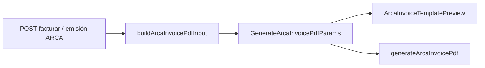

# Plantilla PDF factura ARCA / AFIP

Guía para entender, mantener y **replicar en otro cliente** el comprobante electrónico (preview en pantalla + descarga PDF) alineado al diseño habitual de AFIP/ARCA.

---

## Resumen

| Capa | Tecnología | Rol |
|------|------------|-----|
| **PDF** | `jspdf` + `jspdf-autotable` + `qrcode` | Genera el archivo descargable (A4, triplicado opcional) |
| **Preview** | React + estilos inline | Misma estructura visual que el PDF, sin jsPDF |
| **Datos** | `GenerateArcaInvoicePdfParams` | Contrato único: emisor, comprobante, receptor, ítems, totales, CAE, QR |
| **Origen** | `buildArcaInvoicePdfInput` | Arma el contrato desde venta + respuesta de facturación API |

El frontend **no** habla con AFIP directamente: recibe CAE, número, QR (o los construye) desde la API del cliente y solo **renderiza**.

---

## Dependencias npm

```bash
npm install jspdf jspdf-autotable qrcode
npm install -D @types/qrcode
```

En preview del QR en React (opcional):

```bash
npm install react-qr-code
```

---

## Archivos del proyecto (mapa)

```
lib/
  generate-arca-invoice-pdf.ts   # Orquestador PDF: páginas, tabla, totales, pie
  draw-arca-invoice-header.ts    # Cabecera PDF (ORIGINAL/B, emisor, FACTURA)
  arca-invoice-format.ts         # moneyAr, fechas, colores tabla
  arca-invoice-afip-qr.ts        # URL QR RG 4290 si la API no la envía
  arca-invoice-sample.ts         # Datos de ejemplo (diálogo plantilla)
  build-arca-invoice-pdf-input.ts # Venta + emisión API → GenerateArcaInvoicePdfParams
  facturacion-comprobantes.ts    # Tipo AFIP → letra (A/B/C) y código (006, etc.)

components/
  arca-invoice-header.tsx              # Cabecera preview (3 columnas)
  arca-invoice-template-preview.tsx    # Página completa preview
  arca-invoice-template-dialog.tsx     # Modal plantilla + descarga muestra

public/
  arca-invoice-reference.png           # Referencia visual AFIP (opcional)
```

---

## Flujo de datos



### Contrato principal (`GenerateArcaInvoicePdfParams`)

Definido en `lib/generate-arca-invoice-pdf.ts`. Campos mínimos para replicar:

```typescript
export interface GenerateArcaInvoicePdfParams {
  emisor: {
    razonSocial: string
    domicilio: string
    condicionIva: string
    cuit: string
    ingresosBrutos?: string
    inicioActividades?: string
  }
  comprobante: {
    tipo: number          // WSFE: 6 = Factura B, 11 = Factura C, etc.
    letra?: string        // opcional; si falta se deduce del tipo
    puntoVenta: number
    numero: number
    fechaEmision: string  // ISO yyyy-mm-dd
    concepto: 1 | 2 | 3
  }
  receptor: {
    razonSocial: string
    docTipo: number
    docNro: number
    condicionIvaLabel: string
    domicilio?: string
  }
  items: Array<{
    codigo?: string
    descripcion: string
    cantidad: number
    unidadMedida?: string
    precioUnitario: number
    bonificacionPct?: number
    importeBonificacion?: number
    subtotal: number
  }>
  totales: {
    subtotal: number
    otrosTributos?: number
    total: number
    ivaContenido?: number | null  // Ley 27.743 (Factura B/C)
  }
  cae: string
  caeVencimiento?: string | null
  qrUrl: string
  triplicado?: boolean      // default true → 3 páginas
  copia?: "ORIGINAL" | "DUPLICADO" | "TRIPLICADO"
  condicionVenta?: string
  firmaAutorizada?: string | null
  comprobanteIncompleto?: boolean  // preview sin número AFIP
}
```

### Tipo comprobante → letra y código AFIP

En `lib/facturacion-comprobantes.ts`:

```typescript
const TIPO_A_LETRA: Record<number, string> = {
  1: "A", 6: "B", 11: "C", 3: "A", 8: "B", 13: "C", /* ... */
}
const TIPO_A_CODIGO: Record<number, string> = {
  1: "001", 6: "006", 11: "011", 3: "003", 8: "008", 13: "013",
}

export function getLetraComprobanteAfip(tipo: number): string
export function getCodigoComprobanteAfip(tipo: number): string
export function formatPuntoVentaAfip(pv: number): string   // "00005"
export function formatNumeroComprobanteAfip(nro: number): string  // "00002378"
```

En otro cliente: copiá este módulo o adaptá el mapa a los tipos que emitan.

---

## Formato numérico y fechas (Argentina)

`lib/arca-invoice-format.ts` — compartido PDF y preview:

```typescript
/** 55000 → "55000,00" (coma decimal, sin miles) */
export function moneyAr(n: number): string

/** "$ 55000,00" */
export function moneyArWithSymbol(n: number): string

/** "2026-05-19" → "19/05/2026" */
export function fmtDateAr(iso: string): string

export const ARCA_TABLE_HEADER_RGB: [number, number, number] = [230, 230, 230]
```

---

## Cabecera (punto crítico del layout)

Diseño oficial simplificado:

1. **Franja superior**: `ORIGINAL` / `DUPLICADO` / `TRIPLICADO` (centrado, sin solapar el recuadro).
2. **Línea horizontal** interrumpida por el recuadro de letra (`B`, `A`, `C`).
3. **Tres zonas**: emisor (izq) | recuadro + `COD. 006` (centro) | `FACTURA` + PV/Nro (der).
4. **Divisor vertical** solo **debajo** del bloque central (no atraviesa la letra).

### Errores que se corrigieron

- Poner el recuadro con `position: absolute` y `translate(-50%, -50%)` en el centro de un grid de **2 columnas** hacía que **FACTURA** y **Punto de Venta** quedaran debajo del recuadro.
- Solución: grid de **3 columnas** en preview y en PDF desplazar el texto derecho a `rightX = centerX + BOX_W/2 + margen`.

### Preview — `components/arca-invoice-header.tsx`

```tsx
const CENTER_COL_W = 44

<div style={{
  display: "grid",
  gridTemplateColumns: `minmax(0, 1fr) ${CENTER_COL_W}px minmax(0, 1fr)`,
}}>
  {/* Columna 1: emisor */}
  <div style={{ borderTop: border, padding: "10px 8px 10px 10px" }}>
    <LabelValue label="Razón Social: " value={emisor.razonSocial} />
    {/* ... */}
  </div>

  {/* Columna 2: recuadro B + COD (marginTop negativo para “cortar” la línea) */}
  <div style={{ marginTop: "-19px", background: "#fff", zIndex: 2, ... }}>
    <div style={{ width: 40, height: 38, border: "1px solid #000" }}>{letra}</div>
    <div>COD. {codigo}</div>
  </div>

  {/* Columna 3: FACTURA — ya no compite con el recuadro */}
  <div style={{ borderTop: border, padding: "10px 10px 10px 8px" }}>
    <div style={{ fontWeight: 700 }}>FACTURA</div>
    <LabelValue label="Punto de Venta: " value={...} />
    <LabelValue label="Comp. Nro: " value={...} />
    {/* ... */}
  </div>
</div>
```

### PDF — `lib/draw-arca-invoice-header.ts`

Constantes en milímetros (jsPDF unit `mm`):

```typescript
const COPY_BAR_H = 14   // franja ORIGINAL / DUPLICADO / TRIPLICADO
const BODY_H = 38       // cuerpo emisor + FACTURA
const BOX_W = 12
const BOX_H = 11

// Recuadro centrado en la línea sepY (no invade la franja de copia)
const boxTop = sepY - BOX_H / 2

// Texto derecho empieza DESPUÉS del recuadro
const rightX = centerX + BOX_W / 2 + 2.5
const rightW = margin + innerW - rightX - 2.5
```

Punto de Venta y Comp. Nro van en **líneas separadas** en PDF para evitar choque horizontal.

---

## Generación del PDF

### Entrada única

```typescript
import { generateArcaInvoicePdf } from "@/lib/generate-arca-invoice-pdf"

await generateArcaInvoicePdf({
  emisor: { /* ... */ },
  comprobante: { tipo: 6, puntoVenta: 5, numero: 2378, fechaEmision: "2026-05-19", concepto: 1 },
  receptor: { /* ... */ },
  items: [ /* ... */ ],
  totales: { subtotal: 55000, total: 55000, ivaContenido: 9545.45 },
  cae: "86194547780882",
  caeVencimiento: "2026-05-17",
  qrUrl: "https://www.afip.gob.ar/fe/qr/?p=...",
  triplicado: true,  // false = una sola copia
})
```

Solo funciona en **navegador** (`typeof window !== "undefined"`).

### Desde venta + API (este proyecto)

```typescript
import { generateArcaInvoicePdfFromBuildArgs } from "@/lib/generate-arca-invoice-pdf"

await generateArcaInvoicePdfFromBuildArgs({
  saleId: 123,
  emision: datosDesdePostFacturar,
  facturarPayload: { tipo: 6, condicionIvaReceptor: 5, concepto: 1 },
  cliente: clienteONull,
  saleSnapshot: ventaOpcional,
})
```

`buildArcaInvoicePdfInput` completa emisor (CUIT, razón social, IB), ítems con nombres de producto, QR y flags `comprobanteIncompleto` si falta número en preview.

### Estructura de cada página (`drawInvoicePage`)

Orden vertical aproximado:

1. Marco A4 (`doc.rect`).
2. `drawArcaInvoiceHeader` → devuelve `y` para continuar.
3. Bloque **receptor** (2×2 celdas + condición de venta).
4. Tabla ítems (`autoTable`, cabecera gris `ARCA_TABLE_HEADER_RGB`).
5. Caja **totales** (subtotal, otros tributos, total; opcional Ley 27.743).
6. Firma autorizada (cursiva, centrada).
7. Pie: QR, texto ARCA, paginación, CAE.

Triplicado: bucle `FACTURA_COPIAS = ["ORIGINAL", "DUPLICADO", "TRIPLICADO"]`, una página por copia.

```typescript
export const FACTURA_COPIAS = ["ORIGINAL", "DUPLICADO", "TRIPLICADO"] as const
```

---

## QR AFIP

Si la API no devuelve `qrUrl`, se arma con `buildAfipQrUrl` (`lib/arca-invoice-afip-qr.ts`) según RG 4290:

```typescript
const payload = {
  ver: 1,
  fecha: "2026-05-19",
  cuit: 20339985945,
  ptoVta: 5,
  tipoCmp: 6,
  nroCmp: 2378,
  importe: 55000,
  moneda: "PES",
  ctz: 1,
  tipoDocRec: 99,
  nroDocRec: 0,
  tipoCodAut: "E",
  codAut: 86194547780882,
}
// Base64 → https://www.afip.gob.ar/fe/qr/?p=...
```

En PDF el QR se rasteriza con `qrcode` → `doc.addImage`. En preview: `<QRCodeSVG value={qrUrl} size={90} />`.

---

## Preview en UI

```tsx
import { ArcaInvoiceTemplatePreview } from "@/components/arca-invoice-template-preview"
import { getArcaInvoiceSampleParams } from "@/lib/arca-invoice-sample"

<ArcaInvoiceTemplatePreview data={getArcaInvoiceSampleParams()} triplicado />
```

- `triplicado={false}` → una sola copia.
- `comprobanteIncompleto: true` → banner amarillo y `Comp. Nro: —`.

El componente `ArcaInvoiceHeader` debe mantenerse **alineado** con `draw-arca-invoice-header.ts` (mismos bloques, distinto motor de dibujo).

---

## Cómo replicar en otro cliente (checklist)

### 1. Copiar módulos base

Copiá al nuevo repo (ajustando imports `@/`):

| Archivo | ¿Obligatorio? |
|---------|----------------|
| `arca-invoice-format.ts` | Sí |
| `facturacion-comprobantes.ts` | Sí (o equivalente) |
| `arca-invoice-afip-qr.ts` | Sí si generás QR local |
| `draw-arca-invoice-header.ts` | Sí para PDF |
| `generate-arca-invoice-pdf.ts` | Sí |
| `arca-invoice-header.tsx` | Sí si querés preview |
| `arca-invoice-template-preview.tsx` | Recomendado |
| `build-arca-invoice-pdf-input.ts` | Adaptar a tu API |

### 2. Personalizar datos del emisor

En `build-arca-invoice-pdf-input.ts` (o env):

```typescript
const EMISOR_DEFAULT = {
  razonSocial: "RAZON SOCIAL DEL CLIENTE",
  domicilio: "Calle 123 - Ciudad, Provincia",
  condicionIva: "IVA Responsable Inscripto",
  ingresosBrutos: "123456",
  inicioActividades: "01/01/2020",
  firmaAutorizada: "Nombre Apellido",
}
```

CUIT y punto de venta: desde settings o respuesta de facturación.

### 3. Conectar con tu API de facturación

Tras emitir comprobante, mapear respuesta a `GenerateArcaInvoicePdfParams`:

| Campo PDF | Origen típico API |
|-----------|-------------------|
| `comprobante.numero` | `numero` / `nroCmp` |
| `comprobante.puntoVenta` | `ptoVta` |
| `comprobante.tipo` | `tipoCmp` |
| `cae` | `cae` / `codAut` |
| `caeVencimiento` | `fechaVtoCae` |
| `qrUrl` | `qrUrl` o `buildAfipQrUrl(...)` |
| `items` | líneas de venta o detalle fiscal |

### 4. Botón “Descargar PDF”

```typescript
"use client"

async function onDownloadPdf() {
  const params = await buildArcaInvoicePdfInput({ /* args */ })
  await generateArcaInvoicePdf(params)
}
```

### 5. Validar layout

- Abrí el diálogo de plantilla con `getArcaInvoiceSampleParams()`.
- Compará con `public/arca-invoice-reference.png` si lo tenés.
- Revisá **ORIGINAL**, **DUPLICADO** y **TRIPLICADO** en PDF.
- Confirmá que **FACTURA** y **Punto de Venta** no queden bajo el recuadro B.

### 6. Ajustes finos

| Qué | Dónde |
|-----|--------|
| Altura cabecera PDF | `COPY_BAR_H`, `BODY_H` en `draw-arca-invoice-header.ts` |
| Ancho columna central preview | `CENTER_COL_W` en `arca-invoice-header.tsx` |
| Columnas tabla | `columnStyles` en `generate-arca-invoice-pdf.ts` |
| Textos legales pie | disclaimer bajo “Comprobante Autorizado” |

---

## Uso en esta app (MF Computers)

- **Facturación** (`app/facturacion/page.tsx`): tras facturar, `generateArcaInvoicePdfFromBuildArgs`; vista previa con `ArcaInvoiceTemplatePreview`.
- **Plantilla de diseño**: `ArcaInvoiceTemplateDialog` + muestra `getArcaInvoiceSampleParams()`.
- Documentación API facturación: `docs/facturacion.md`.

---

## Referencia rápida de llamadas

```typescript
// Solo PDF con objeto ya armado
import { generateArcaInvoicePdf } from "@/lib/generate-arca-invoice-pdf"
await generateArcaInvoicePdf(params)

// PDF desde venta MF API
import { generateArcaInvoicePdfFromBuildArgs } from "@/lib/generate-arca-invoice-pdf"
await generateArcaInvoicePdfFromBuildArgs({ saleId, emision, facturarPayload, cliente })

// PDF sin guardar (ej. enviar por email después)
import { buildArcaInvoicePdf } from "@/lib/generate-arca-invoice-pdf"
const { doc, fileName } = await buildArcaInvoicePdf(params)
const blob = doc.output("blob")
```

---

## Notas legales / funcionales

- El diseño imita el comprobante ARCA/AFIP; la validez fiscal la da la **autorización** (CAE + QR), no el PDF en sí.
- Factura **C** suele llevar “IVA Contenido” (Ley 27.743); activar con `totales.ivaContenido`.
- `comprobanteIncompleto` es solo UX de preview cuando la API aún no devolvió número/QR confirmados.

Si en el otro cliente el stack no es Next.js/React, podés quedarte solo con la capa **jsPDF** (`generate-arca-invoice-pdf.ts` + `draw-arca-invoice-header.ts` + formatos) e ignorar los componentes `components/arca-invoice-*.tsx`.

---

## Código TSX para otro proyecto Next.js

### Estructura de carpetas sugerida

```
tu-proyecto-next/
  components/
    arca-invoice/
      arca-invoice-header.tsx
      arca-invoice-template-preview.tsx
      arca-invoice-template-dialog.tsx   # opcional; requiere shadcn Dialog + Button
  lib/
    arca-invoice-format.ts               # ver sección anterior en este doc
    facturacion-comprobantes.ts          # letra/código AFIP, formatos PV y nro
    generate-arca-invoice-pdf.ts         # PDF (copiar del repo MF)
    arca-invoice-sample.ts               # datos de ejemplo
    arca-invoice-afip-qr.ts              # si armás QR local
  app/
    factura-preview/page.tsx             # ejemplo de uso (abajo)
```

### Dependencias

```bash
npm install react-qr-code jspdf jspdf-autotable qrcode
```

Para el diálogo de muestra (opcional):

```bash
npx shadcn@latest add dialog button
```

### Imports en el proyecto nuevo

Los ejemplos usan alias `@/` (tsconfig `paths`). Si no lo tenés:

```json
// tsconfig.json
{
  "compilerOptions": {
    "paths": { "@/*": ["./*"] }
  }
}
```

O reemplazá `@/lib/...` por rutas relativas (`../../lib/...`).

---

### `components/arca-invoice/arca-invoice-header.tsx`

Cabecera: franja de copia + grid 3 columnas (emisor | B + COD | FACTURA).

```tsx
"use client"

import { fmtDateAr } from "@/lib/arca-invoice-format"
import type { ArcaInvoiceEmisor, GenerateArcaInvoicePdfParams } from "@/lib/generate-arca-invoice-pdf"
import type { FacturaCopia } from "@/lib/generate-arca-invoice-pdf"
import {
  formatNumeroComprobanteAfip,
  formatPuntoVentaAfip,
  getCodigoComprobanteAfip,
  getLetraComprobanteAfip,
} from "@/lib/facturacion-comprobantes"

const border = "1px solid #000"
const font = "Arial, Helvetica, sans-serif"
/** Ancho de la columna central (recuadro letra + COD). */
const CENTER_COL_W = 44

function LabelValue({ label, value }: { label: string; value: string }) {
  return (
    <div style={{ fontSize: "11px", lineHeight: 1.35, marginTop: "3px" }}>
      <span style={{ fontWeight: 700 }}>{label}</span>
      <span>{value}</span>
    </div>
  )
}

export interface ArcaInvoiceHeaderProps {
  copia: FacturaCopia
  emisor: ArcaInvoiceEmisor
  comprobante: GenerateArcaInvoicePdfParams["comprobante"]
  numeroComprobanteDisplay?: string
}

export function ArcaInvoiceHeader({
  copia,
  emisor,
  comprobante,
  numeroComprobanteDisplay,
}: ArcaInvoiceHeaderProps) {
  const letra = comprobante.letra ?? getLetraComprobanteAfip(comprobante.tipo)
  const codigo = getCodigoComprobanteAfip(comprobante.tipo)
  const cuit = String(emisor.cuit).replace(/\D/g, "")

  return (
    <header style={{ fontFamily: font, color: "#000", position: "relative" }}>
      <div
        style={{
          textAlign: "center",
          fontWeight: 700,
          fontSize: "11px",
          padding: "5px 8px",
          borderBottom: border,
          letterSpacing: "0.03em",
        }}
      >
        {copia}
      </div>

      <div
        style={{
          position: "relative",
          display: "grid",
          gridTemplateColumns: `minmax(0, 1fr) ${CENTER_COL_W}px minmax(0, 1fr)`,
          alignItems: "start",
          minHeight: "108px",
        }}
      >
        <div
          aria-hidden
          style={{
            position: "absolute",
            left: "50%",
            top: "52px",
            bottom: 0,
            width: "1px",
            background: "#000",
            transform: "translateX(-50%)",
            pointerEvents: "none",
          }}
        />

        <div style={{ borderTop: border, padding: "10px 8px 10px 10px" }}>
          <LabelValue label="Razón Social: " value={emisor.razonSocial} />
          <LabelValue label="Domicilio Comercial: " value={emisor.domicilio} />
          <LabelValue label="Condición frente al IVA: " value={emisor.condicionIva} />
        </div>

        <div
          style={{
            display: "flex",
            flexDirection: "column",
            alignItems: "center",
            textAlign: "center",
            marginTop: "-19px",
            paddingBottom: "4px",
            background: "#fff",
            zIndex: 2,
          }}
        >
          <div
            style={{
              width: "40px",
              height: "38px",
              border,
              display: "flex",
              alignItems: "center",
              justifyContent: "center",
              fontSize: "26px",
              fontWeight: 700,
              lineHeight: 1,
              background: "#fff",
            }}
          >
            {letra}
          </div>
          <div style={{ fontSize: "9px", marginTop: "2px", lineHeight: 1.2, whiteSpace: "nowrap" }}>
            COD. {codigo}
          </div>
        </div>

        <div style={{ borderTop: border, padding: "10px 10px 10px 8px" }}>
          <div style={{ fontWeight: 700, fontSize: "13px", marginBottom: "4px", letterSpacing: "0.02em" }}>
            FACTURA
          </div>
          <LabelValue label="Punto de Venta: " value={formatPuntoVentaAfip(comprobante.puntoVenta)} />
          <LabelValue
            label="Comp. Nro: "
            value={numeroComprobanteDisplay ?? formatNumeroComprobanteAfip(comprobante.numero)}
          />
          <LabelValue label="Fecha de Emisión: " value={fmtDateAr(comprobante.fechaEmision)} />
          <LabelValue label="CUIT: " value={cuit} />
          <LabelValue label="Ingresos Brutos: " value={emisor.ingresosBrutos ?? "—"} />
          <LabelValue
            label="Fecha de Inicio de Actividades: "
            value={emisor.inicioActividades ?? "—"}
          />
        </div>
      </div>

      <div aria-hidden style={{ borderBottom: border }} />
    </header>
  )
}
```

---

### `components/arca-invoice/arca-invoice-template-preview.tsx`

Comprobante completo en HTML (receptor, tabla, totales, QR, CAE). Soporta triplicado.

```tsx
"use client"

import QRCodeSVG from "react-qr-code"
import {
  FACTURA_COPIAS,
  type FacturaCopia,
  type GenerateArcaInvoicePdfParams,
} from "@/lib/generate-arca-invoice-pdf"
import {
  fmtDateAr,
  formatDocReceptor,
  moneyAr,
  moneyArWithSymbol,
} from "@/lib/arca-invoice-format"
import { ArcaInvoiceHeader } from "@/components/arca-invoice/arca-invoice-header"

const border = "1px solid #000"
const headerBg = "#e6e6e6"
const font = "Arial, Helvetica, sans-serif"

function LabelValue({
  label,
  value,
  className,
}: {
  label: string
  value: string
  className?: string
}) {
  return (
    <div className={className} style={{ fontSize: "11px", lineHeight: 1.35 }}>
      <span style={{ fontWeight: 700 }}>{label}</span>
      <span>{value}</span>
    </div>
  )
}

export interface ArcaInvoiceTemplatePreviewProps {
  data: GenerateArcaInvoicePdfParams
  className?: string
  triplicado?: boolean
}

export function ArcaInvoiceTemplatePreview({
  data,
  className,
  triplicado = true,
}: ArcaInvoiceTemplatePreviewProps) {
  const copias: FacturaCopia[] =
    triplicado === false ? [data.copia ?? "ORIGINAL"] : [...FACTURA_COPIAS]

  return (
    <div className={className} style={{ display: "flex", flexDirection: "column", gap: "24px" }}>
      {copias.map((copia, index) => (
        <ArcaInvoiceCopyPreview
          key={copia}
          data={data}
          copia={copia}
          pagina={copias.length > 1 ? `${index + 1}/${copias.length}` : "1/1"}
        />
      ))}
    </div>
  )
}

interface ArcaInvoiceCopyPreviewProps {
  data: GenerateArcaInvoicePdfParams
  copia: FacturaCopia
  pagina: string
}

function ArcaInvoiceCopyPreview({ data, copia, pagina }: ArcaInvoiceCopyPreviewProps) {
  return (
    <div
      style={{
        fontFamily: font,
        fontSize: "11px",
        color: "#000",
        background: "#fff",
        border,
        maxWidth: "210mm",
        margin: "0 auto",
      }}
    >
      {data.comprobanteIncompleto ? (
        <div
          style={{
            background: "#fff8e6",
            borderBottom: border,
            padding: "6px 10px",
            fontSize: "10px",
            color: "#664d03",
          }}
        >
          Nº de comprobante y QR no confirmados (faltan datos AFIP en la API).
        </div>
      ) : null}
      <ArcaInvoiceHeader
        copia={copia}
        emisor={data.emisor}
        comprobante={data.comprobante}
        numeroComprobanteDisplay={data.comprobanteIncompleto ? "—" : undefined}
      />

      <div style={{ borderTop: border, fontSize: "11px" }}>
        <div style={{ display: "grid", gridTemplateColumns: "1fr 1fr", borderBottom: border }}>
          <div style={{ padding: "6px 10px", borderRight: border }}>
            <LabelValue
              label="Doc.: "
              value={formatDocReceptor(data.receptor.docTipo, data.receptor.docNro)}
            />
          </div>
          <div style={{ padding: "6px 10px" }}>
            <LabelValue label="Apellido y Nombre / Razón Social: " value={data.receptor.razonSocial} />
          </div>
        </div>
        <div style={{ display: "grid", gridTemplateColumns: "1fr 1fr", borderBottom: border }}>
          <div style={{ padding: "6px 10px", borderRight: border }}>
            <LabelValue label="Condición frente al IVA: " value={data.receptor.condicionIvaLabel} />
          </div>
          <div style={{ padding: "6px 10px" }}>
            <LabelValue label="Domicilio: " value={data.receptor.domicilio ?? ""} />
          </div>
        </div>
        <div style={{ padding: "6px 10px" }}>
          <LabelValue label="Condición de venta: " value={data.condicionVenta ?? "Contado"} />
        </div>
      </div>

      <table style={{ width: "100%", borderCollapse: "collapse", fontSize: "10px" }}>
        <thead>
          <tr style={{ background: headerBg }}>
            {[
              "Código",
              "Producto / Servicio",
              "Cantidad",
              "U. Medida",
              "Precio Unit.",
              "% Bonif",
              "Imp. Bonif.",
              "Subtotal",
            ].map((h) => (
              <th
                key={h}
                style={{
                  border,
                  padding: "5px 4px",
                  fontWeight: 700,
                  textAlign: h === "Producto / Servicio" || h === "Código" ? "left" : "right",
                }}
              >
                {h}
              </th>
            ))}
          </tr>
        </thead>
        <tbody>
          {data.items.map((it, i) => (
            <tr key={i}>
              <td style={{ border, padding: "4px" }}>{it.codigo ?? ""}</td>
              <td style={{ border, padding: "4px", textAlign: "left" }}>{it.descripcion}</td>
              <td style={{ border, padding: "4px", textAlign: "right" }}>{moneyAr(it.cantidad)}</td>
              <td style={{ border, padding: "4px", textAlign: "center" }}>{it.unidadMedida ?? "unidades"}</td>
              <td style={{ border, padding: "4px", textAlign: "right" }}>{moneyAr(it.precioUnitario)}</td>
              <td style={{ border, padding: "4px", textAlign: "right" }}>{moneyAr(it.bonificacionPct ?? 0)}</td>
              <td style={{ border, padding: "4px", textAlign: "right" }}>
                {moneyAr(it.importeBonificacion ?? 0)}
              </td>
              <td style={{ border, padding: "4px", textAlign: "right" }}>{moneyAr(it.subtotal)}</td>
            </tr>
          ))}
        </tbody>
      </table>

      <div style={{ borderTop: border, borderBottom: border, padding: "10px 12px", minHeight: "72px" }}>
        <div style={{ float: "right", width: "220px", fontSize: "11px" }}>
          <TotalRow label="Subtotal: $" value={data.totales.subtotal} />
          <TotalRow label="Importe Otros Tributos: $" value={data.totales.otrosTributos ?? 0} />
          <TotalRow label="Importe Total: $" value={data.totales.total} bold />
          {data.totales.ivaContenido != null ? (
            <div style={{ marginTop: "10px", borderTop: "1px solid #999", paddingTop: "6px" }}>
              <p
                style={{
                  fontWeight: 700,
                  fontSize: "10px",
                  marginBottom: "4px",
                  fontStyle: "italic",
                  textDecoration: "underline",
                  margin: 0,
                }}
              >
                Régimen de Transparencia Fiscal al Consumidor (Ley 27.743)
              </p>
              <TotalRow label="IVA Contenido: $" value={data.totales.ivaContenido} />
            </div>
          ) : null}
        </div>
        <div style={{ clear: "both" }} />
      </div>

      {data.firmaAutorizada ? (
        <div style={{ textAlign: "center", padding: "10px 0 6px", fontStyle: "italic", fontSize: "11px" }}>
          &quot;{data.firmaAutorizada}&quot;
        </div>
      ) : null}

      <div
        style={{
          display: "grid",
          gridTemplateColumns: "1fr auto 1fr",
          alignItems: "end",
          padding: "8px 10px 12px",
          gap: "8px",
          fontSize: "10px",
        }}
      >
        <div>
          {data.qrUrl ? (
            <QRCodeSVG value={data.qrUrl} size={90} level="M" />
          ) : (
            <div
              style={{
                width: 90,
                height: 90,
                border: "1px dashed #999",
                display: "flex",
                alignItems: "center",
                justifyContent: "center",
                fontSize: "8px",
                color: "#666",
                textAlign: "center",
                padding: 4,
              }}
            >
              QR no disponible
            </div>
          )}
          <div style={{ fontWeight: 700, marginTop: "4px" }}>ARCA</div>
          <div>Comprobante Autorizado</div>
          <div style={{ fontSize: "8px", maxWidth: "140px", lineHeight: 1.3, marginTop: "2px" }}>
            Esta Agencia no se responsabiliza por los datos ingresados en el detalle de la operación
          </div>
        </div>
        <div style={{ textAlign: "center", alignSelf: "center" }}>Pág. {pagina}</div>
        <div style={{ textAlign: "right", fontSize: "11px" }}>
          <LabelValue label="CAE N°: " value={data.cae} />
          <LabelValue
            label="Fecha de Vto. de CAE: "
            value={data.caeVencimiento ? fmtDateAr(data.caeVencimiento) : "—"}
            className="mt-1"
          />
        </div>
      </div>
    </div>
  )
}

function TotalRow({ label, value, bold }: { label: string; value: number; bold?: boolean }) {
  return (
    <div
      style={{
        display: "flex",
        justifyContent: "space-between",
        marginBottom: "3px",
        fontWeight: bold ? 700 : 400,
      }}
    >
      <span>{label}</span>
      <span>{moneyArWithSymbol(value)}</span>
    </div>
  )
}
```

---

### `components/arca-invoice/arca-invoice-template-dialog.tsx` (opcional)

Modal con preview + botón “Descargar PDF de muestra”. Requiere shadcn `Dialog` y `Button`.

```tsx
"use client"

import { useMemo, useState } from "react"
import {
  Dialog,
  DialogContent,
  DialogDescription,
  DialogFooter,
  DialogHeader,
  DialogTitle,
} from "@/components/ui/dialog"
import { Button } from "@/components/ui/button"
import { Download, FileText, Loader2 } from "lucide-react"
import { ArcaInvoiceTemplatePreview } from "@/components/arca-invoice/arca-invoice-template-preview"
import { getArcaInvoiceSampleParams } from "@/lib/arca-invoice-sample"
import { generateArcaInvoicePdf } from "@/lib/generate-arca-invoice-pdf"
import { getTipoComprobanteLabel } from "@/lib/facturacion-comprobantes"

export interface ArcaInvoiceTemplateDialogProps {
  open: boolean
  onOpenChange: (open: boolean) => void
}

export function ArcaInvoiceTemplateDialog({ open, onOpenChange }: ArcaInvoiceTemplateDialogProps) {
  const sample = useMemo(() => getArcaInvoiceSampleParams(), [open])
  const [isDownloading, setIsDownloading] = useState(false)

  const handleDownloadSample = async () => {
    setIsDownloading(true)
    try {
      await generateArcaInvoicePdf(sample)
    } catch (e) {
      console.error("Error al generar PDF muestra:", e)
      alert("No se pudo generar el PDF de muestra.")
    } finally {
      setIsDownloading(false)
    }
  }

  return (
    <Dialog open={open} onOpenChange={onOpenChange}>
      <DialogContent className="flex max-h-[92vh] max-w-4xl flex-col gap-0 p-0">
        <DialogHeader className="shrink-0 border-b px-6 py-4">
          <DialogTitle className="flex items-center gap-2">
            <FileText className="h-5 w-5" />
            Plantilla de factura ARCA / AFIP
          </DialogTitle>
          <DialogDescription>
            Vista previa del diseño por triplicado (ORIGINAL, DUPLICADO, TRIPLICADO). Datos de ejemplo (
            {getTipoComprobanteLabel(sample.comprobante.tipo)}).
          </DialogDescription>
        </DialogHeader>

        <div className="min-h-0 flex-1 overflow-y-auto bg-muted/40 p-4 md:p-6">
          <ArcaInvoiceTemplatePreview data={sample} />
        </div>

        <DialogFooter className="shrink-0 border-t px-6 py-4 gap-2 sm:gap-0">
          <Button variant="outline" onClick={() => onOpenChange(false)}>
            Cerrar
          </Button>
          <Button variant="secondary" onClick={() => void handleDownloadSample()} disabled={isDownloading}>
            {isDownloading ? (
              <Loader2 className="mr-2 h-4 w-4 animate-spin" />
            ) : (
              <Download className="mr-2 h-4 w-4" />
            )}
            {isDownloading ? "Generando…" : "Descargar PDF de muestra"}
          </Button>
        </DialogFooter>
      </DialogContent>
    </Dialog>
  )
}
```

---

### `lib/arca-invoice-sample.ts` (datos de prueba)

Copiá del repo MF o usá este esqueleto (ajustá CUIT, razón social y QR):

```typescript
import { buildAfipQrUrl } from "@/lib/arca-invoice-afip-qr"
import type { GenerateArcaInvoicePdfParams } from "@/lib/generate-arca-invoice-pdf"

export function getArcaInvoiceSampleParams(): GenerateArcaInvoicePdfParams {
  const tipo = 6
  const puntoVenta = 5
  const numero = 2378
  const fechaEmision = "2026-05-19"
  const cuit = "20123456789"
  const total = 55000

  const qrUrl = buildAfipQrUrl({
    fechaEmision,
    cuitEmisor: cuit,
    puntoVenta,
    tipoComprobante: tipo,
    numeroComprobante: numero,
    importe: total,
    docTipoReceptor: 99,
    docNroReceptor: 0,
    cae: "86194547780882",
  })

  return {
    emisor: {
      razonSocial: "TU RAZON SOCIAL",
      domicilio: "Calle 123 - Ciudad",
      condicionIva: "IVA Responsable Inscripto",
      cuit,
      ingresosBrutos: "123456",
      inicioActividades: "01/01/2020",
    },
    comprobante: { tipo, puntoVenta, numero, fechaEmision, concepto: 1 },
    receptor: {
      razonSocial: "Consumidor Final",
      docTipo: 99,
      docNro: 0,
      condicionIvaLabel: "Consumidor Final",
    },
    items: [
      {
        descripcion: "Producto ejemplo",
        cantidad: 1,
        unidadMedida: "unidades",
        precioUnitario: total,
        subtotal: total,
      },
    ],
    totales: { subtotal: total, otrosTributos: 0, total, ivaContenido: 9545.45 },
    cae: "86194547780882",
    caeVencimiento: "2026-05-29",
    qrUrl,
    condicionVenta: "Contado",
    firmaAutorizada: "Nombre Apellido",
  }
}
```

---

### Página de ejemplo — `app/factura-preview/page.tsx`

Vista previa sin modal (útil para validar el diseño en otro repo).

```tsx
"use client"

import { ArcaInvoiceTemplatePreview } from "@/components/arca-invoice/arca-invoice-template-preview"
import { getArcaInvoiceSampleParams } from "@/lib/arca-invoice-sample"
import { generateArcaInvoicePdf } from "@/lib/generate-arca-invoice-pdf"

export default function FacturaPreviewPage() {
  const data = getArcaInvoiceSampleParams()

  return (
    <main className="min-h-screen bg-neutral-100 p-6">
      <div className="mx-auto mb-4 flex max-w-4xl flex-wrap gap-2">
        <button
          type="button"
          className="rounded-md bg-black px-4 py-2 text-sm text-white"
          onClick={() => void generateArcaInvoicePdf(data)}
        >
          Descargar PDF (triplicado)
        </button>
        <button
          type="button"
          className="rounded-md border px-4 py-2 text-sm"
          onClick={() => void generateArcaInvoicePdf({ ...data, triplicado: false })}
        >
          Descargar PDF (solo ORIGINAL)
        </button>
      </div>

      <ArcaInvoiceTemplatePreview data={data} />
    </main>
  )
}
```

---

### Uso embebido tras facturar (patrón MF)

En tu página de ventas/facturación, cuando ya tenés `GenerateArcaInvoicePdfParams`:

```tsx
"use client"

import { useState } from "react"
import { ArcaInvoiceTemplatePreview } from "@/components/arca-invoice/arca-invoice-template-preview"
import { generateArcaInvoicePdf } from "@/lib/generate-arca-invoice-pdf"
import type { GenerateArcaInvoicePdfParams } from "@/lib/generate-arca-invoice-pdf"

export function FacturaEmitidaPanel({ invoice }: { invoice: GenerateArcaInvoicePdfParams }) {
  const [open, setOpen] = useState(true)

  return (
    <div>
      <button type="button" onClick={() => void generateArcaInvoicePdf(invoice)}>
        Descargar PDF
      </button>
      {open ? (
        <div className="mt-4 overflow-auto rounded border bg-white p-4">
          <ArcaInvoiceTemplatePreview data={invoice} triplicado={false} />
        </div>
      ) : null}
    </div>
  )
}
```

---

### Qué copiar además del TSX (PDF alineado con preview)

Para que el PDF descargado coincida con la preview, copiá también desde este repositorio:

| Archivo | Motivo |
|---------|--------|
| `lib/generate-arca-invoice-pdf.ts` | Generador PDF completo |
| `lib/draw-arca-invoice-header.ts` | Cabecera PDF (misma lógica 3 zonas) |
| `lib/arca-invoice-format.ts` | `moneyAr`, `fmtDateAr`, etc. |
| `lib/facturacion-comprobantes.ts` | Letra/código AFIP |
| `lib/arca-invoice-afip-qr.ts` | QR si la API no lo envía |

Los tres `.tsx` de arriba **no generan PDF**; solo muestran HTML. El botón de descarga llama a `generateArcaInvoicePdf` en el cliente.

---

### Checklist rápido otro Next.js

1. `npm install react-qr-code jspdf jspdf-autotable qrcode`
2. Copiar `lib/` (formato, comprobantes, PDF, QR, sample).
3. Crear `components/arca-invoice/` con los 3 TSX de este doc.
4. Ajustar imports `@/` y datos del emisor en `getArcaInvoiceSampleParams`.
5. Abrir `/factura-preview` y validar cabecera (FACTURA no tapada por B).
6. Probar descarga PDF triplicado.
